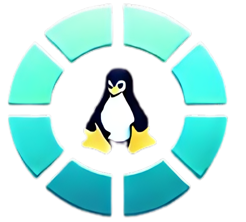

# **Daros**

Website yang menirukan sistem operasi dengan antarmuka Desktop GNOME.

---



## 🌟 **Fitur**

- Antarmuka yang menyerupai GNOME Desktop
- Interaksi dengan menu konteks (klik kanan)
- Navigasi dan tata letak berbasis sistem desktop
- ***

## ⚒️ **Teknologi yang Digunakan**

- **Next.js** (Fullstack Framework)
- **React & TypeScript** (Frontend Development)
- **Tailwind CSS** (Styling)
- **lucide-react** (Ikon)

---

1. **Instal dependensi:**

```bash
npm install
# atau
yarn install
# atau
pnpm install
# atau
bun install
```

1. **Jalankan server pengembangan:**

```bash
npm run dev
# atau
yarn dev
# atau
pnpm dev
# atau
bun dev
```

1. **Buka di browser:**

```
http://localhost:3000
```

---

## info folder | file

### route '/' main DESTOP **app/page.tsx**

1. `dash-panel-top.tsx` : menjadi header bagian atas
2. `mobilWarning.tsx` : Sebuah popup yg akan muncul menurut settingan tertentu
3. `destop/destop.tsx` : Adalah tampilan utama Destop Gnome
4. `dash-panel-top.tsx` : menjadi header menu (**Taskbar**) di tengah

### 🖥️ **Dibuat oleh:**

[bgdar](https://github.com/bgdar)

Happy coding! 🚀
